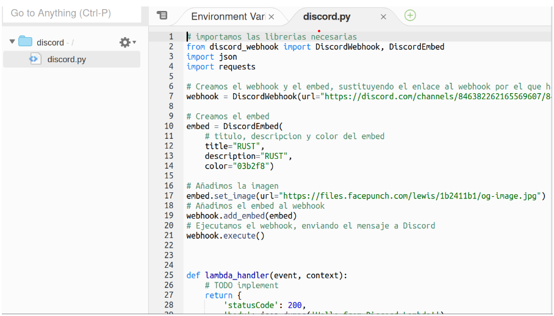

1. **Crear SCRIPT**  
Primero creamos un script en python, que enviará el mensaje a discord.  
 
2. **Instalamos repositorio**  
Para ello, en la consola:  
pip install discord-webhook  
3. **Crear capa en AWS**  
Para ello, nos vamos a crear una capa en aws e introducimos los parametros necesarios como en las capturas.  

4. **Crear función AWS**  
Ahora crearemos una función en aws a la que le asignaremos la capa que acabamos de crear. 
 
5. **Comprobamos que se ha subido el código en AWS**  
